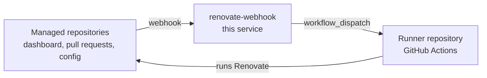

# renovate-self-hosted

*English | [日本語](README_ja.md)*

A small Go service that receives GitHub webhooks and starts self-hosted
[Renovate](https://docs.renovatebot.com/) runs on demand.

Renovate itself is executed by a GitHub Actions workflow in a **separate runner
repository**. This service never runs Renovate: it validates the delivery,
decides whether it really means "run Renovate against this repository", and
triggers the runner workflow through the `workflow_dispatch` API.



## What triggers a run

| Event | Condition | Reason reported |
| --- | --- | --- |
| `issues` (`edited`) | A checkbox on Renovate's Dependency Dashboard issue went from unticked to ticked | `dependency-dashboard-checkbox` |
| `pull_request` (`edited`) | A checkbox in a Renovate pull request body went from unticked to ticked, for example the rebase/retry box | `pull-request-checkbox` |
| `push` | A Renovate configuration file changed on the default branch | `config-push` |

A push payload carries at most 20 commits, and nothing in it says whether
GitHub truncated the list. A push at that limit is therefore treated as a
possible config change and runs anyway, rather than silently skipping one that
happened in a commit the payload never carried.

Everything else is answered with `200 {"status":"ignored"}` and a reason, so
GitHub's delivery log stays green and it is obvious why nothing happened.

Checkbox detection compares the previous body (`changes.body.from`) with the new
one and reports the items that were newly ticked. Items are matched on the HTML
comment Renovate attaches to each control (`rebase-check`, `manual job`,
`unlimit-branch=…`), falling back to the visible label, so reordering the
dashboard does not produce phantom triggers.

Two guards keep the service from chasing its own tail:

- the issue or pull request must be authored by a configured Renovate bot, and
- the edit must **not** have been made by that bot — Renovate rewrites these
  bodies at the end of every run, which would otherwise loop forever.

Events for the same repository that arrive close together are coalesced into a
single run (see `DEBOUNCE_WINDOW`), so ticking five boxes in a row costs one
Renovate run rather than five.

## Configuration

All configuration comes from the environment.

| Variable | Default | Description |
| --- | --- | --- |
| `RENOVATE_WEBHOOK_SECRET` | — | **Required.** Secret shared with the GitHub webhook, used for the `X-Hub-Signature-256` check. |
| `RUNNER_REPOSITORY` | — | **Required.** `owner/repo` of the repository holding the Renovate runner workflow. |
| `GITHUB_TOKEN` | — | **Required** unless `DRY_RUN=true`. Token allowed to dispatch that workflow (`actions: write`). |
| `RENOVATE_WEBHOOK_ADDR` | `:8080` | Listen address. |
| `RENOVATE_WEBHOOK_PATH` | `/webhook` | Path GitHub posts to. |
| `RENOVATE_WEBHOOK_LOG_LEVEL` | `info` | `debug`, `info`, `warn` or `error`. |
| `RENOVATE_WEBHOOK_SHUTDOWN_TIMEOUT` | `15s` | Graceful shutdown budget. |
| `GITHUB_API_URL` | `https://api.github.com` | Point at `https://<host>/api/v3` for GitHub Enterprise Server. |
| `RUNNER_WORKFLOW` | `renovate.yml` | Workflow file name (or numeric ID) to dispatch. |
| `RUNNER_REF` | `main` | Git ref the workflow runs on. |
| `RUNNER_REPOSITORY_INPUT` | `repositories` | Workflow input that receives the target `owner/repo`. |
| `RUNNER_EXTRA_INPUTS` | — | Extra inputs as `key=value,key=value`. A fragment without an `=` continues the previous value, so a value may contain commas (`labels=area/foo,area/bar`). Only inputs the workflow declares may be sent; GitHub rejects the whole dispatch otherwise. |
| `RENOVATE_BOT_LOGINS` | `renovate[bot],renovate-bot` | Accounts whose issues and pull requests count as Renovate's. |
| `ALLOWED_REPOSITORIES` | — | Optional allow list, `owner/repo` or `owner/*`. Unset allows every repository; set but containing no usable entry is a startup error rather than a silent "allow everything". |
| `TRIGGER_ON_PUSH` | `true` | Whether config pushes trigger a run. |
| `PUSH_CONFIG_PATHS` | `renovate.json`, `renovate.json5`, `.renovaterc*`, `.github/renovate.json*`, `.gitlab/renovate.json` | Paths treated as Renovate configuration. |
| `DEBOUNCE_WINDOW` | `10s` | Quiet period before a repository's run is dispatched. |
| `DEBOUNCE_MAX_WAIT` | `2m` | Upper bound on that quiet period, so a busy repository still runs. |
| `DRY_RUN` | `false` | Log what would be dispatched instead of calling GitHub. |

Endpoints: the webhook path, plus `GET /healthz` and `GET /readyz`.

## Setting up

### 1. Runner repository

Copy [`examples/workflows/renovate.yml`](examples/workflows/renovate.yml) to
`.github/workflows/renovate.yml` in the repository that should execute Renovate,
and add a `RENOVATE_TOKEN` secret there. The file has to be on that repository's
default branch before `workflow_dispatch` will accept it.

### 2. This service

On Kubernetes, with the chart in [`deploy/helm/renovate-webhook`](deploy/helm/renovate-webhook):

```sh
kubectl create secret generic renovate-webhook \
  --from-literal=RENOVATE_WEBHOOK_SECRET=... \
  --from-literal=GITHUB_TOKEN=...

helm install renovate-webhook deploy/helm/renovate-webhook \
  --set config.runnerRepository=acme/renovate-runner \
  --set secret.existingSecret=renovate-webhook \
  --set ingress.enabled=true \
  --set ingress.hosts[0].host=renovate-webhook.example.com
```

The chart can also create the secret from values (`secret.webhookSecret`,
`secret.githubToken`) for a quick trial. `helm install --set config.dryRun=true`
logs the decisions without dispatching anything. Everything else is documented
in [`values.yaml`](deploy/helm/renovate-webhook/values.yaml); the chart refuses
to install rather than crash-looping when a required value is missing.

Releases publish a multi-architecture image to
`ghcr.io/nonchan7720/renovate-self-hosted` and the chart itself to
`oci://ghcr.io/nonchan7720/charts`, so a tagged version can be installed
without a checkout:

```sh
helm install renovate-webhook oci://ghcr.io/nonchan7720/charts/renovate-webhook \
  --version 0.1.0 \
  --set config.runnerRepository=acme/renovate-runner \
  --set secret.existingSecret=renovate-webhook
```

Or plain Docker:

```sh
docker build -t renovate-webhook .
docker run --rm -p 8080:8080 \
  -e RENOVATE_WEBHOOK_SECRET=... \
  -e GITHUB_TOKEN=... \
  -e RUNNER_REPOSITORY=acme/renovate-runner \
  renovate-webhook
```

Start with `-e DRY_RUN=true` to watch the decisions in the logs without
dispatching anything.

#### Replicas

The debounce state lives in memory, so each replica only coalesces the events
it received itself: two replicas can dispatch two runs for the same repository.
The runner workflow serialises those with a concurrency group, so the cost is
an extra run rather than a race. The chart defaults to a single replica.

### 3. GitHub webhook

Add an organization or repository webhook pointing at the service with content
type `application/json`, the same secret, and these events:

- **Issues** — Dependency Dashboard checkboxes
- **Pull requests** — rebase/retry checkboxes
- **Pushes** — optional, for Renovate config changes

## Development

The toolchain is pinned in [`mise.toml`](mise.toml) (Go 1.26.7, golangci-lint
2.12.2, Helm 4.2.4):

```sh
mise install
go test -race ./...
golangci-lint run
helm lint deploy/helm/renovate-webhook \
  --set config.runnerRepository=acme/renovate-runner \
  --set secret.webhookSecret=example --set secret.githubToken=example
```

Releases are managed by [release-please](https://github.com/googleapis/release-please):
merging to `main` maintains a release pull request from the commit messages, and
merging that tags the version, which in turn publishes the image and the chart.
The chart's `version` and `appVersion` are kept in step with the tag.

An image carries exactly one kind of tag, so it is always clear which build a
deployment is running:

| Tag | Published on | For |
| --- | --- | --- |
| the commit hash, e.g. `1a2b3c4` | every push to `main` | staging |
| the version, e.g. `0.1.0` | a published release | production |

There is deliberately no `latest` or moving major/minor tag. Point staging at a
hash with `--set image.tag=1a2b3c4`; production takes the version from the
chart's `appVersion` and needs no override. The chart itself is only published
for a release, since its version comes from `Chart.yaml`.

The service has no third-party dependencies; everything is standard library.

| Package | Responsibility |
| --- | --- |
| `internal/config` | Environment configuration and validation |
| `internal/webhook` | Signature check, event routing, checkbox diffing |
| `internal/queue` | Per-repository debouncing |
| `internal/dispatch` | `workflow_dispatch` client with retries |
| `internal/server` | HTTP server, health probes, graceful shutdown |
| `deploy/helm` | Helm chart for running the service on Kubernetes |
