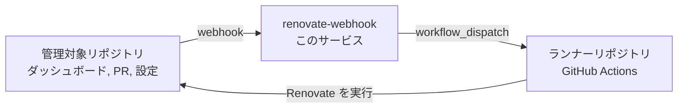

# renovate-self-hosted

*[English](README.md) | 日本語*

GitHub の Webhook を受けて、セルフホストの [Renovate](https://docs.renovatebot.com/)
を必要なときだけ実行させる小さな Go サービスです。

Renovate 自体は**別のランナーリポジトリ**にある GitHub Actions ワークフローが実行します。
このサービスが Renovate を動かすことはありません。配信の検証を行い、それが本当に
「このリポジトリに対して Renovate を実行せよ」という意味なのかを判断し、
`workflow_dispatch` API でランナーのワークフローを起動するところまでが仕事です。



## 実行のトリガ

| イベント | 条件 | 記録される reason |
| --- | --- | --- |
| `issues` (`edited`) | Renovate の Dependency Dashboard issue のチェックボックスが未チェックからチェックに変わった | `dependency-dashboard-checkbox` |
| `pull_request` (`edited`) | Renovate の PR 本文のチェックボックスが未チェックからチェックに変わった（rebase/retry のボックスなど） | `pull-request-checkbox` |
| `push` | デフォルトブランチで Renovate の設定ファイルが変更された | `config-push` |

push のペイロードに含まれるコミットは最大20件で、GitHub が切り詰めたかどうかを示す
フィールドはありません。そのため上限に達している push は「設定が変更された可能性がある」
とみなして実行します。ペイロードに載らなかったコミットでの変更を黙って取りこぼすよりは、
余分に1回走るほうがましなので。

それ以外はすべて `200 {"status":"ignored"}` と理由を返します。GitHub の配信ログが
赤くならず、なぜ何も起きなかったのかがそのまま分かります。

チェックボックスの検出は、以前の本文（`changes.body.from`）と新しい本文を比較して、
**新たにチェックされた項目**だけを報告します。項目の同一性は Renovate が各コントロールに
付ける HTML コメント（`rebase-check`、`manual job`、`unlimit-branch=…`）で判定し、
無い場合のみ表示テキストにフォールバックします。ダッシュボードの並び順が変わっただけで
誤発火することはありません。

自分自身を追いかけてしまわないよう、ガードが2つあります。

- issue または PR の作成者が、設定された Renovate bot であること
- その編集が、その bot によるもので**ない**こと — Renovate は実行のたびにこれらの本文を
  書き換えるため、これが無いと永久にループします

同じリポジトリに対して短時間に届いたイベントは1回の実行にまとめられます
（`DEBOUNCE_WINDOW` を参照）。チェックボックスを5個続けて押しても、Renovate の実行は
5回ではなく1回で済みます。

## 設定

設定はすべて環境変数から読み込みます。

| 変数 | 既定値 | 説明 |
| --- | --- | --- |
| `RENOVATE_WEBHOOK_SECRET` | — | **必須。** GitHub の Webhook と共有するシークレット。`X-Hub-Signature-256` の検証に使います。 |
| `RUNNER_REPOSITORY` | — | **必須。** Renovate 実行ワークフローを持つリポジトリの `owner/repo`。 |
| `GITHUB_TOKEN` | — | `DRY_RUN=true` でない限り**必須**。そのワークフローを dispatch できるトークン（`actions: write`）。 |
| `RENOVATE_WEBHOOK_ADDR` | `:8080` | 待ち受けアドレス。 |
| `RENOVATE_WEBHOOK_PATH` | `/webhook` | GitHub が POST するパス。 |
| `RENOVATE_WEBHOOK_LOG_LEVEL` | `info` | `debug` / `info` / `warn` / `error`。 |
| `RENOVATE_WEBHOOK_SHUTDOWN_TIMEOUT` | `15s` | グレースフルシャットダウンの猶予。 |
| `GITHUB_API_URL` | `https://api.github.com` | GitHub Enterprise Server では `https://<host>/api/v3` を指定します。 |
| `RUNNER_WORKFLOW` | `renovate.yml` | dispatch するワークフローのファイル名（または数値 ID）。 |
| `RUNNER_REF` | `main` | ワークフローを実行する Git ref。 |
| `RUNNER_REPOSITORY_INPUT` | `repositories` | 対象の `owner/repo` を受け取るワークフロー入力の名前。 |
| `RUNNER_EXTRA_INPUTS` | — | 追加の入力を `key=value,key=value` 形式で。`=` を含まない断片は直前の値の続きとして扱われるため、値自体にカンマを含められます（`labels=area/foo,area/bar`）。ワークフローが宣言していない入力を送ると GitHub は dispatch 全体を拒否します。 |
| `RENOVATE_BOT_LOGINS` | `renovate[bot],renovate-bot` | issue や PR の作成者として Renovate とみなすアカウント。 |
| `ALLOWED_REPOSITORIES` | — | 任意の許可リスト。`owner/repo` または `owner/*`。空ならすべて許可。 |
| `TRIGGER_ON_PUSH` | `true` | 設定ファイルの push で実行するかどうか。 |
| `PUSH_CONFIG_PATHS` | `renovate.json`, `renovate.json5`, `.renovaterc*`, `.github/renovate.json*`, `.gitlab/renovate.json` | Renovate の設定ファイルとして扱うパス。 |
| `DEBOUNCE_WINDOW` | `10s` | リポジトリの実行を dispatch するまでの待機時間。 |
| `DEBOUNCE_MAX_WAIT` | `2m` | その待機時間の上限。イベントが途切れないリポジトリでも実行されます。 |
| `DRY_RUN` | `false` | GitHub を呼ばず、dispatch する内容をログに出すだけにします。 |

エンドポイントは Webhook のパスに加えて `GET /healthz` と `GET /readyz`。

## セットアップ

### 1. ランナーリポジトリ

[`examples/workflows/renovate.yml`](examples/workflows/renovate.yml) を、Renovate を
実行するリポジトリの `.github/workflows/renovate.yml` にコピーし、そこに
`RENOVATE_TOKEN` シークレットを追加します。`workflow_dispatch` が受け付けるには、
このファイルがそのリポジトリのデフォルトブランチ上に存在している必要があります。

### 2. このサービス

Kubernetes の場合は [`deploy/helm/renovate-webhook`](deploy/helm/renovate-webhook)
のチャートを使います。

```sh
kubectl create secret generic renovate-webhook \
  --from-literal=RENOVATE_WEBHOOK_SECRET=... \
  --from-literal=GITHUB_TOKEN=...

helm install renovate-webhook deploy/helm/renovate-webhook \
  --set config.runnerRepository=acme/renovate-runner \
  --set secret.existingSecret=renovate-webhook \
  --set ingress.enabled=true \
  --set ingress.hosts[0].host=renovate-webhook.example.com
```

チャートに values からシークレットを作らせることもできます
（`secret.webhookSecret`、`secret.githubToken`）。お試しにはこちらが手軽です。
`helm install --set config.dryRun=true` にすると、dispatch せずに判断だけをログに出します。
その他の設定は [`values.yaml`](deploy/helm/renovate-webhook/values.yaml) に記載しています。
必須の値が欠けている場合、チャートは CrashLoopBackOff になる代わりにインストール自体を
失敗させます。

イメージはクラスタが pull できる場所に置く必要があります。公開先に合わせて
`image.repository` と `image.tag` を設定してください。

Docker で動かす場合:

```sh
docker build -t renovate-webhook .
docker run --rm -p 8080:8080 \
  -e RENOVATE_WEBHOOK_SECRET=... \
  -e GITHUB_TOKEN=... \
  -e RUNNER_REPOSITORY=acme/renovate-runner \
  renovate-webhook
```

まずは `-e DRY_RUN=true` を付けて、何も dispatch せずに判断をログで眺めるのがおすすめです。

#### レプリカ数について

デバウンスの状態はメモリ上にあるため、各レプリカは自分が受け取ったイベントしか
まとめられません。つまり2レプリカあれば、同じリポジトリに対して2回 dispatch され得ます。
ランナー側のワークフローが concurrency group で直列化するので、代償は競合ではなく
「実行が1回余分に走る」ことです。チャートの既定は1レプリカです。

### 3. GitHub の Webhook

organization またはリポジトリの Webhook をこのサービスに向けて追加します。
content type は `application/json`、シークレットは同じものを設定し、
以下のイベントを購読します。

- **Issues** — Dependency Dashboard のチェックボックス
- **Pull requests** — rebase/retry のチェックボックス
- **Pushes** — 任意。Renovate の設定変更を拾う場合

## 開発

ツールチェーンは [`mise.toml`](mise.toml) に固定しています
（Go 1.26.7、golangci-lint 2.12.2、Helm 4.2.4）。

```sh
mise install
go test -race ./...
golangci-lint run
helm lint deploy/helm/renovate-webhook \
  --set config.runnerRepository=acme/renovate-runner \
  --set secret.webhookSecret=example --set secret.githubToken=example
```

サードパーティ依存はありません。すべて標準ライブラリです。

| パッケージ | 役割 |
| --- | --- |
| `internal/config` | 環境変数からの設定読み込みと検証 |
| `internal/webhook` | 署名検証、イベントのルーティング、チェックボックスの差分検出 |
| `internal/queue` | リポジトリ単位のデバウンス |
| `internal/dispatch` | リトライ付きの `workflow_dispatch` クライアント |
| `internal/server` | HTTP サーバ、ヘルスチェック、グレースフルシャットダウン |
| `deploy/helm` | Kubernetes で動かすための Helm チャート |
